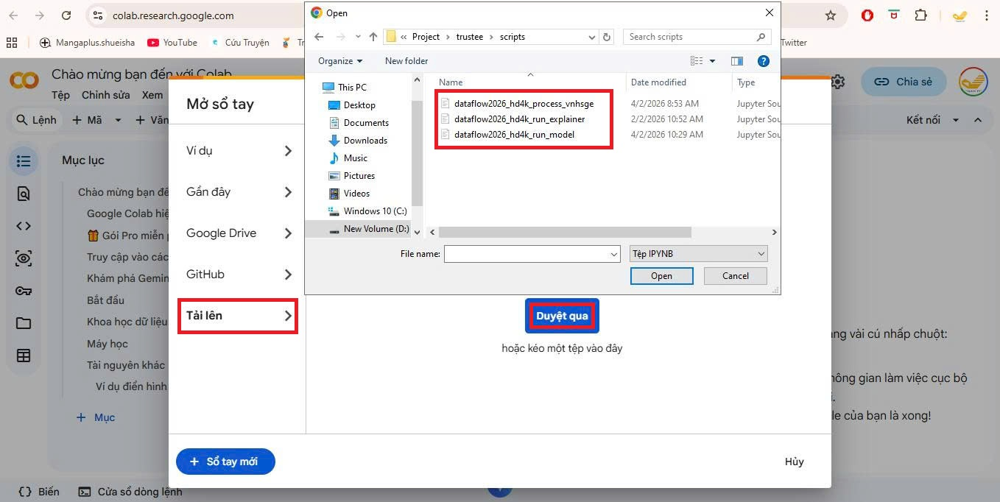
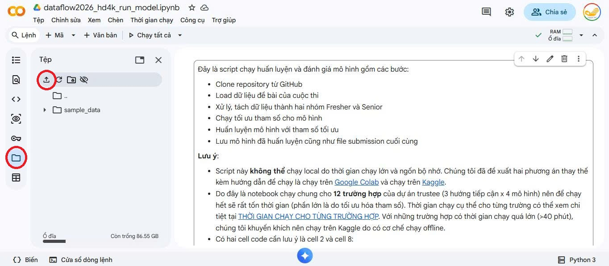
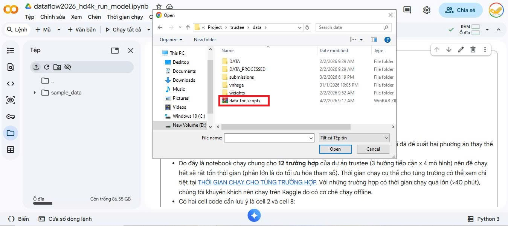

# Hướng dẫn chạy scripts trên Google Colab
Do tính bảo mật của bộ dữ liệu của cuộc thi, các scripts muốn chạy trên Google Colab buộc phải qua một bước tải dữ liệu. File này sẽ hướng dẫn cụ thể cách tải dữ liệu lên và chạy notebook.

## Bước 1: Tải notebook lên Google Colab
- Truy cập vào trang [Google Colab](https://colab.research.google.com/). Ở tab "Tải lên", bấm "Duyệt qua" và chọn một trong các scripts muốn chạy trong thư mục trustee/scripts.

## Bước 2: Tải dữ liệu lên Google Colab
- Ở thanh bên trái, mục "Tệp" và chọn ký hiệu tải lên để tải dữ liệu từ máy tính cá nhân lên Google Colab.

- Tìm trong thư mục trustee, file data/data_for_scripts.zip là file chứa dữ liệu để chạy notebook. File zip này là file nén hai thư mục data/DATA và data/DATA_PROCESSED.

- Như vậy là giờ bạn đã có thể chạy Notebook thoải mái trên Google Colab rồi.