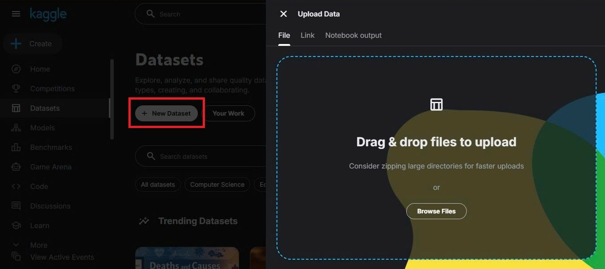
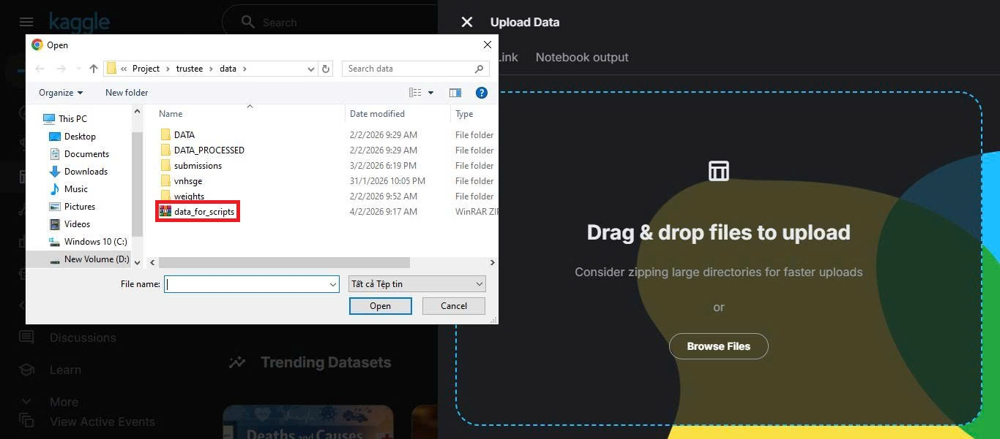
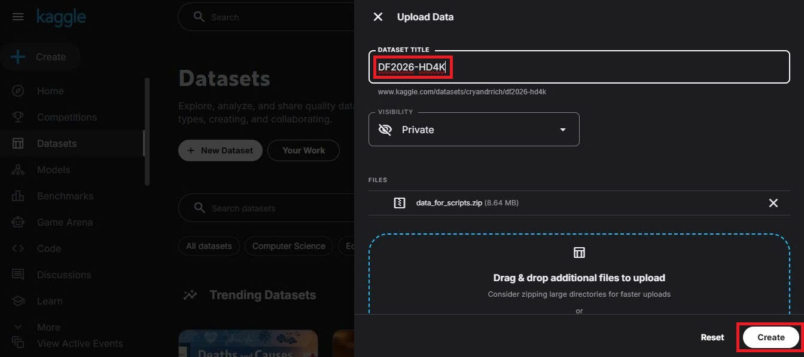
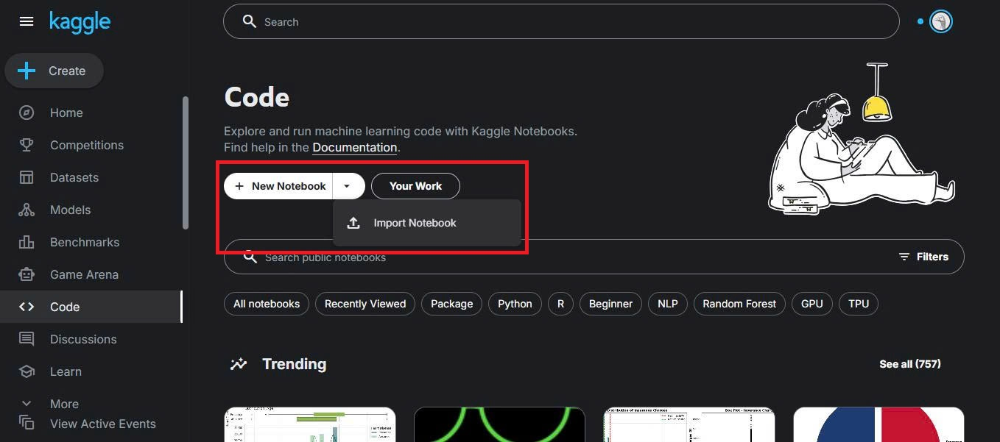
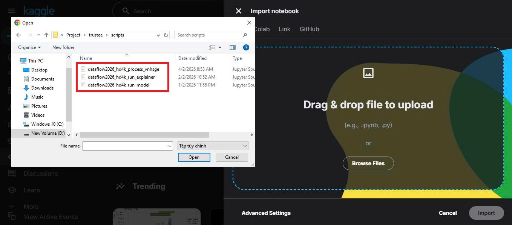
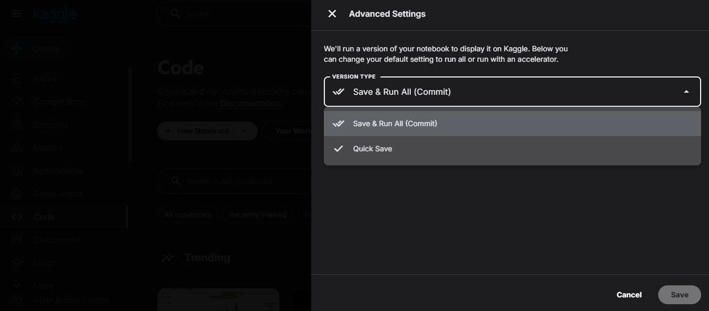
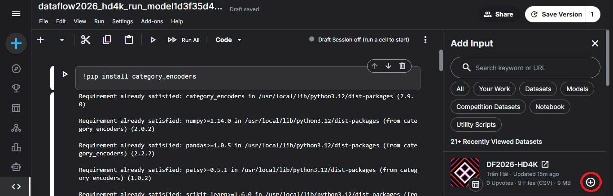

# Hướng dẫn chạy scripts trên Kaggle
Do tính bảo mật của bộ dữ liệu của cuộc thi, các scripts muốn chạy trên Kaggle buộc phải qua một bước tải dữ liệu lên Kaggle để notebook có thể chạy được. File này sẽ hướng dẫn cụ thể cách tải dữ liệu lên và chạy notebook.

## Bước 1: Tạo Datasets trên Kaggle
- Truy cập vào trang [Kaggle Datasets](https://www.kaggle.com/datasets) và bấm "+ New Dataset".

- Bấm "Browse Files" và tìm trong thư mục trustee, file data/data_for_scripts.zip là file chứa dữ liệu để chạy notebook. File zip này là file nén ba thư mục data/DATA, data/DATA_PROCESSED và data/weights.

- Thực hiện đặt tên Datasets là "DF2026-HD4K" (**Bắt buộc**) và bấm "Create", việc này sẽ tốn khoảng 2-3 phút. Sau khi hoàn thành thì tắt tab này đi.

## Bước 2: Tải notebook lên Kaggle
- Truy cập vào trang [Kaggle Notebooks](https://www.kaggle.com/code). Bấm vào mũi tên bên cạnh "+ New Notebook", chọn "Import Notebook".

- Bấm "Browse Files" và bạn chọn một trong các scripts muốn chạy trong thư mục trustee/scripts.

- Ở dưới bấm vào nút "Advanced Settings" và chỉnh Version Type thành "Quick Save" (để tránh notebook tự chạy lúc mới tải lên) sau đó bấm "Save" rồi bấm "Import" và đợi 10-20 giây.

## Bước 3: Kết nối Datasets với Notebook
- Sau khi tải notebook lên xong, bấm vào phần "Edit" ở góc trên bên phải.

- Ở bên phải, bấm vào nút "+ Add Input". Thông thường, bộ dataset "DF2026-HD4K" bạn vừa tạo sẽ xuất hiện đầu tiên do bạn mới tạo, nếu không thấy bạn có thể tìm kiếm nó trong thanh tìm kiếm bằng dán URL. Bấm vào dấu "+". Khi dấu "+" chuyển thành dấu "-" tức là đã thành công, bấm vào dấu "X" ở bên phải chữ Add Input.

- Như vậy là giờ bạn đã có thể chạy Notebook thoải mái trên Kaggle rồi.